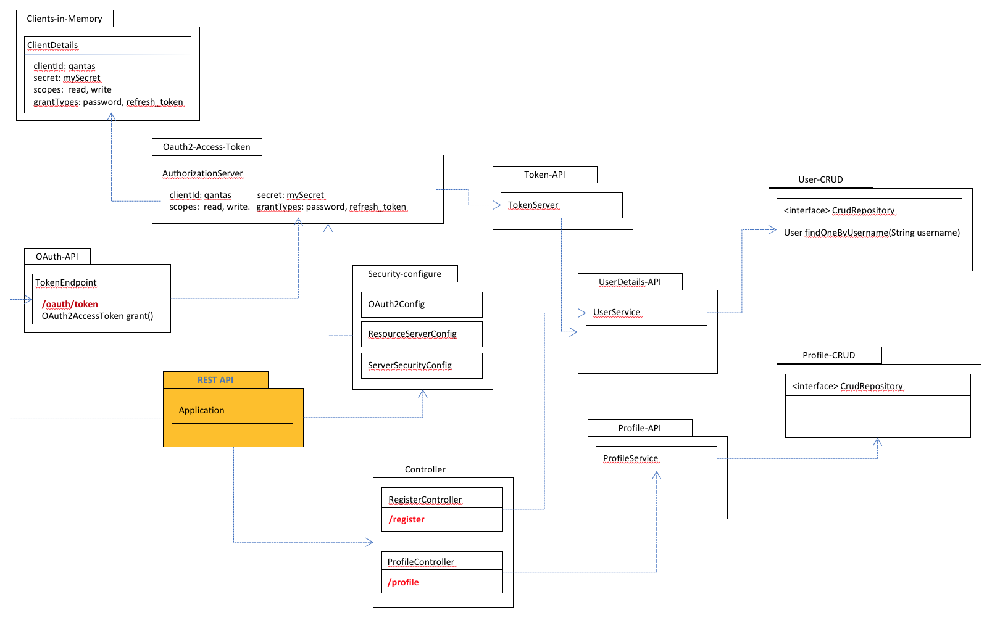

## Qantas Profile API

This REST API supports for customers to manage their profile (create, update and delete).
There are two API paths. One is register which is public api and the other is profile which is secured API.
The secure API needs access token which can be created '/oauth/token' with qantas client.



**Test Application**

Using Maven Command: Go to the root folder of the project using command prompt and run the command.
```
mvn spring-boot:run
```

**SWAGGER API Contract Definition**

[Swagger](http://localhost:8080/qantas/swagger-ui.htm) UI allows anyone to visualize and interact with the API’s resources without having any of the implementation logic in place. 

**H2 Database**

H2 ships with a web based database [console](http://localhost:8080/qantas/h2-console/), which you can use while your application is under development. It is a convenient way to view the tables created by Hibernate and run queries against the in memory database.  Here is an example of the H2 database console.


**CURL Example to create a User**
```
curl -v -X POST http://localhost:8080/qantas/register \
  -H 'accept: */*' -H 'Content-Type: application/json' \
  -d '{"username": "jaehlee11@gmail.com", "password": "password", "firstname": "Jaehun", "lastname": "Lee", "dob" : "2018-06-17T05:52:39.963Z", "address": []}'
```

**CURL Example to get an access token**
```
curl -v -X POST http://localhost:8080/qantas/oauth/token \
  --user 'qantas:mySecret' \
  -d 'grant_type=password' \
  -d 'username=jaehlee11@gmail.com' \
  -d 'password=password'
```

**CURL Example to update a User**
```
curl -vi -X PUT http://localhost:8080/qantas/profile \
  -H 'Accept: application/json' \
  -H 'Content-type: application/json' \
  -H 'Authorization: Bearer [TOKEN]' \
  -d '{"id":"1", "firstname":"Jaehun", "lastname":"Lee", "dob" : "2018-06-17T10:42:35.273Z", "address":[{"type":"HOME", "value":"4 Mills Ave"},{"type":"EMAIL", "value":"jaehlee@gmail.com"}]}'
```

**CURL Example to get a User**
```
curl -v -X GET http://localhost:8080/qantas/profile/1 \
  -H 'Accept: application/json' \
  -H 'Content-type: application/json' \
  -H 'Authorization: Bearer [TOKEN]'
```

**CURL Example to delete a User**
```
curl -vi -X DELETE http://localhost:8080/qantas/profile/1 \
  -H 'Accept: application/json' \
  -H 'Content-type: application/json' \
  -H 'Authorization: Bearer [TOKEN]'
```
